I'll rewrite this markdown without emojis in a more human style:

# Car Price Prediction

## Business Understanding
The goal is to enhance the pricing precision of used vehicles by identifying key factors influencing car prices. By leveraging vehicle attributes, we aim to develop a model that predicts the market price with high accuracy, enabling better decision-making and competitive pricing in the used car market.

## Data Understanding
Key features influencing car price:
- **Manufacturer & Model**: Impacts price through brand reputation and demand.
- **Year**: Newer cars are generally more expensive.
- **Odometer**: Higher mileage usually lowers price.
- **Condition**: Quality of the car (e.g., excellent, good, fair).
- **Fuel Type**: Varies in price based on fuel type (gasoline, electric).
- **Engine Type**: More powerful engines may lead to higher prices.
- **Cylinder**: Affects fuel efficiency and performance.

## Exploratory Data Analysis (EDA)
EDA uncovers trends, correlations, and outliers, providing insights into influential features for predicting car prices.

### Missing Value Overview
To better understand the completeness of our dataset, we visualized the missing values across key features:
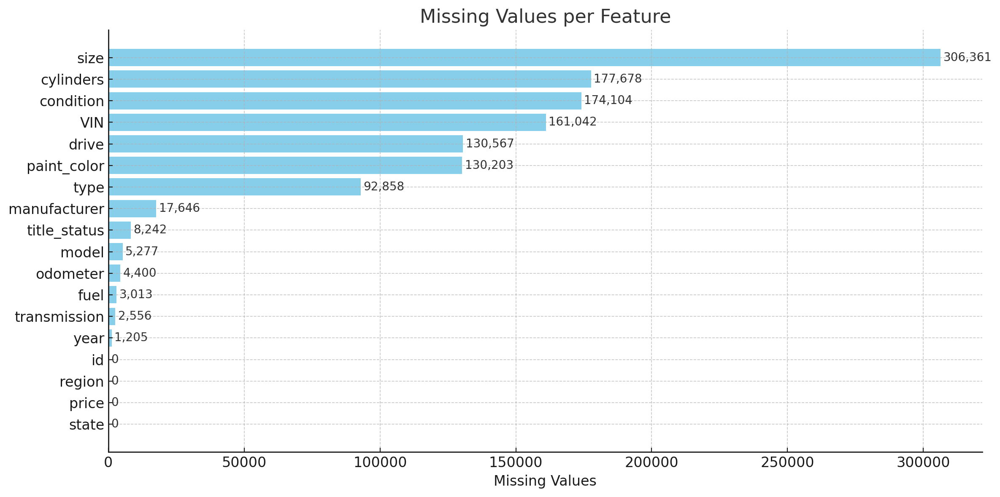

## Data Preparation & Feature Engineering

### Data Cleaning
- **Extracting VIN Information**: Using the `VIN` library, extract car details like **model**, **year**, **manufacturer**, and **body class**.
- **Reducing Categorical Values**: Simplify categories in `I_type`, `I_model`, and `I_manufacturer` for better performance.

### Category Distribution Analysis
To understand the data distribution across key categorical features, we visualized the value counts for each major category:

#### Vehicle Types
The distribution of different vehicle types in our dataset shows which body styles are most common in the used car market:
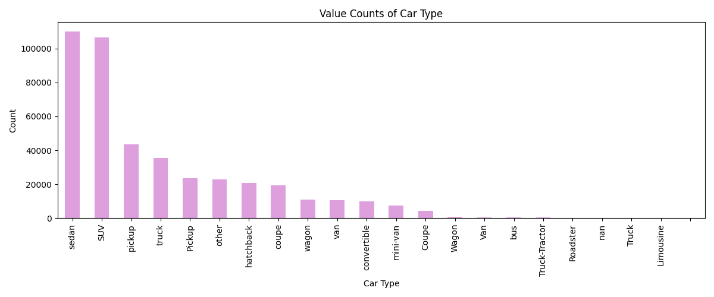

#### Manufacturers
This visualization reveals the most common car manufacturers in our dataset, helping us understand brand representation:
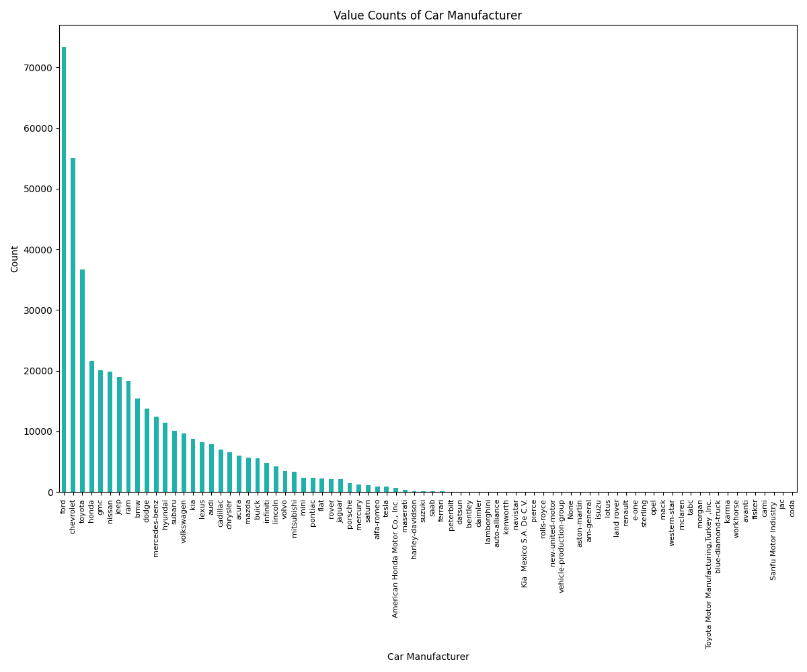

#### Models
The distribution of car models demonstrates which specific models appear most frequently in our dataset:
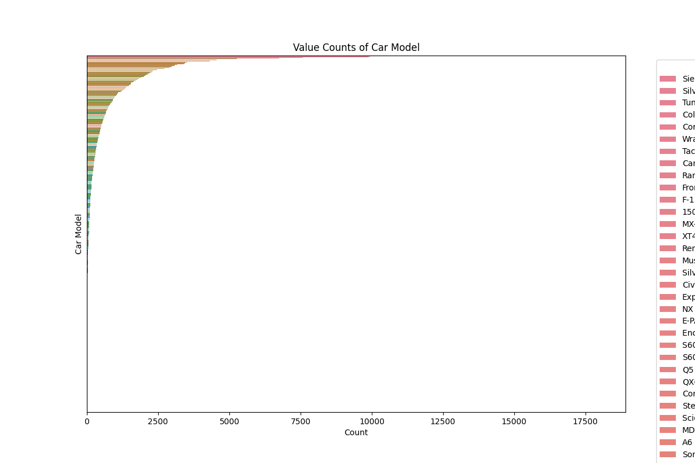

#### General Categories
Our broader category classification shows how vehicles are distributed across major segments:
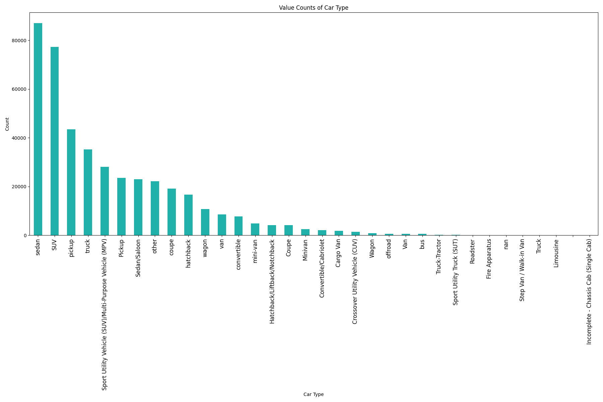

These visualizations helped inform our feature engineering approach, particularly for managing high cardinality categorical variables before model training.

### Feature Imputation
We use **James-Stein Estimator** for imputing missing values in the `cylinders` feature. This method shrinks individual group means toward the global mean, reducing overfitting and improving accuracy.

### Handling Outliers
Outliers are detected using the **IQR method** and replaced with the median value, especially for `odometer` and `price`, to prevent skewing the results.

## Ordinal Encoding for 'Condition' & 'Title_Status'
We encode `condition` and `title_status` as ordinal variables:
- **Condition**: New = 6, Like New = 5, Excellent = 4, Good = 3, Fair = 2, Salvage = 1
- **Title Status**: Clean = 6, Lien = 5, Rebuilt = 4, Salvage = 3, Parts Only = 2, Missing = 1

## James-Stein Encoding for High Cardinality
For features like `paint_color` and `type`, **James-Stein encoding** balances category-specific mean encoding with global mean to reduce overfitting and dimensionality, improving model robustness.

### Correlation Heatmap
We generated a heatmap to visualize the correlation between numerical features and identify relationships that could influence car pricing:
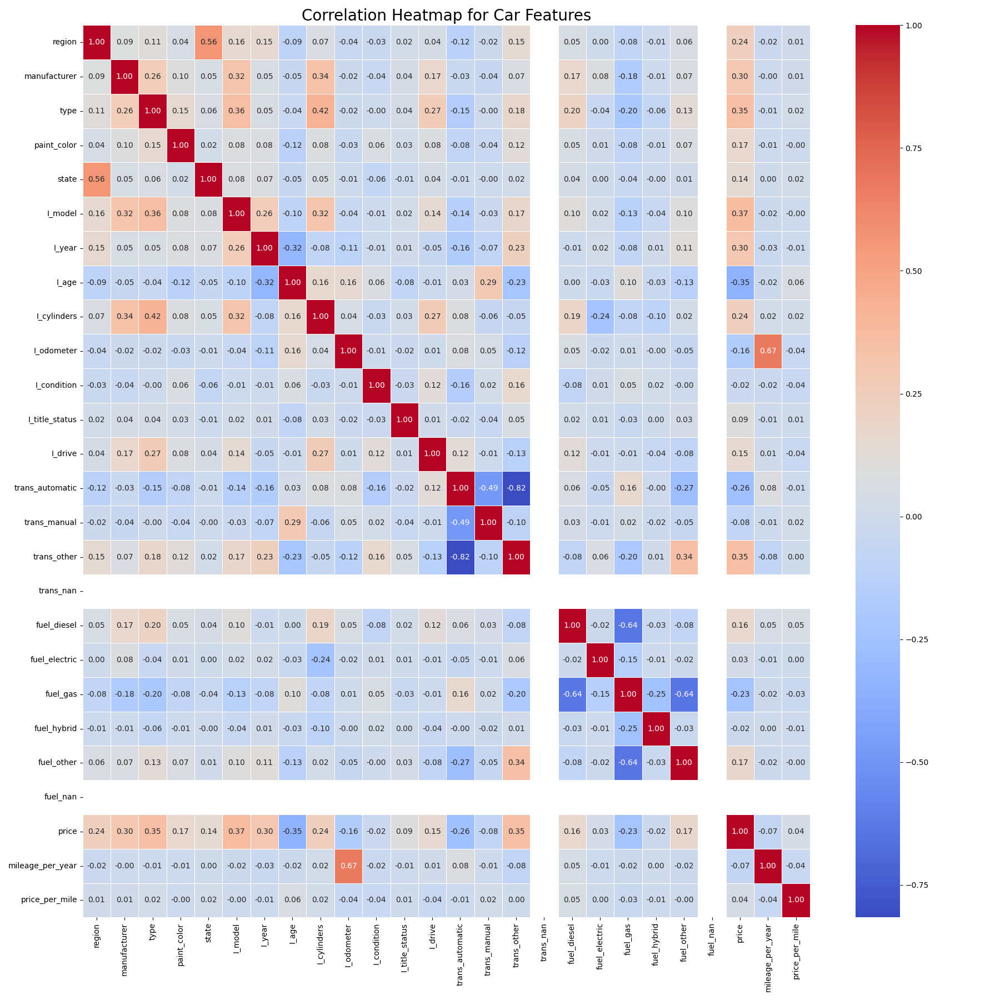

## Model Building
We will build a **supervised regression model** using models like:
- **Linear Regression**
- **Linear Regression with Polynomial Features**
- **Ridge Regressor**
- **Lasso Regressor**

### Feature Importance Analysis

#### Linear Regression: Top 20 Features
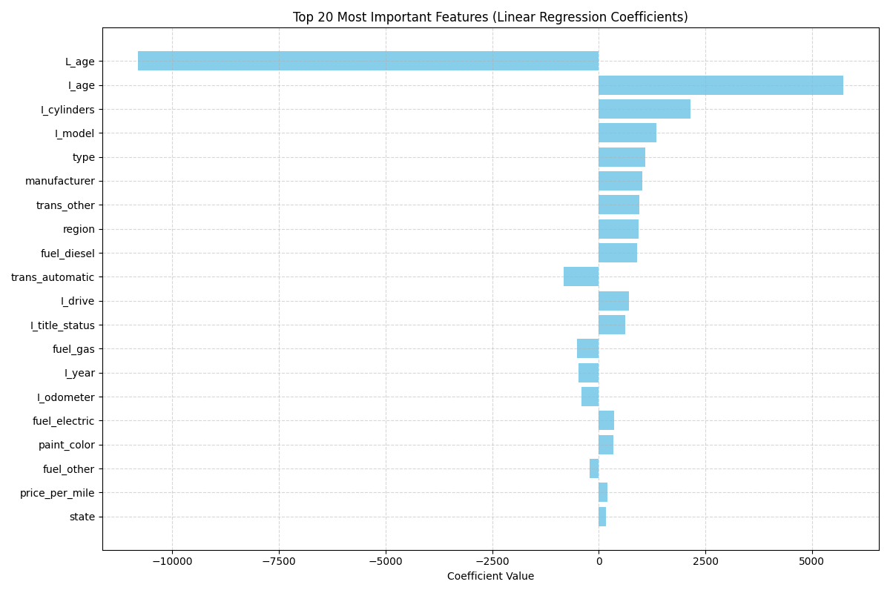
The linear regression model identifies these features as most impactful, with particular emphasis on vehicle age, mileage, and manufacturer reputation.

#### Linear Regression with Polynomial Features: Top 20 Features
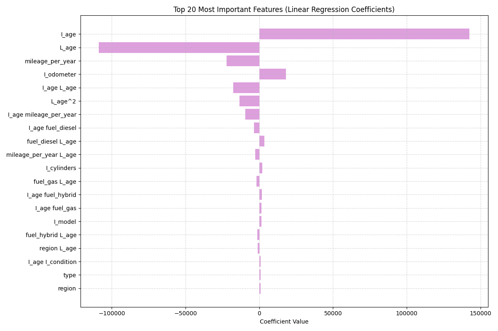
When using polynomial features, we observe interaction effects between variables, with combined year-mileage factors showing significant importance.

## Principal Component Analysis (PCA)
To reduce dimensionality while preserving information content, we performed Principal Component Analysis on our feature set.

### Variance Capture Analysis
Our PCA analysis revealed that just 20 principal components capture approximately 95% of the total variance in the dataset. This finding indicates that despite having numerous features, the effective dimensionality of our data is considerably lower.
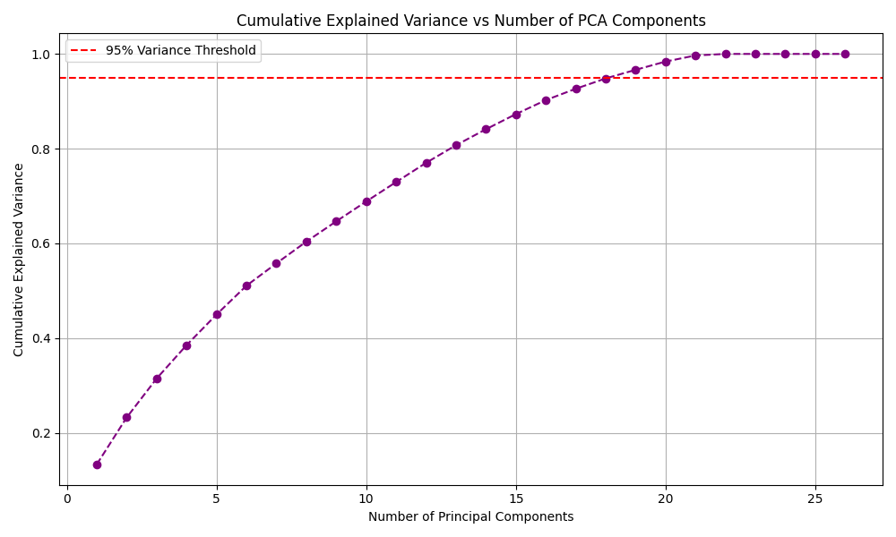

The cumulative explained variance plot above demonstrates how quickly the principal components capture the dataset's variability. This efficient representation of the data helps us reduce computational complexity while maintaining predictive power.

### Scree Plot Analysis
The scree plot below shows the individual explained variance contribution of each principal component, highlighting where the "elbow" occurs in the variance explanation curve.
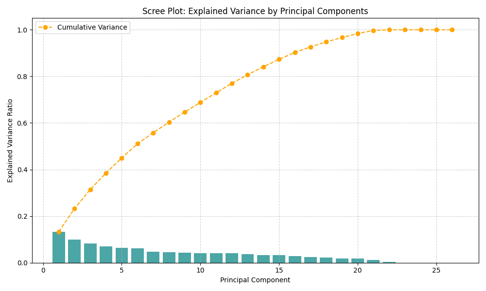

The steep initial decline followed by a flattening curve indicates that the first several components capture significant variance, while later components contribute minimally. This pattern supports our decision to focus on the top 20 components for dimensionality reduction.

### Implications for Modeling
By reducing our feature space to 20 principal components, we:
- Decreased computational complexity
- Mitigated multicollinearity issues
- Reduced the risk of overfitting
- Maintained 95% of the original information content

This dimensionality reduction approach complements our feature importance analysis from the different regression models while providing a transformation that captures the essential structure of our data.

#### Ridge Regressor: Top 20 Features
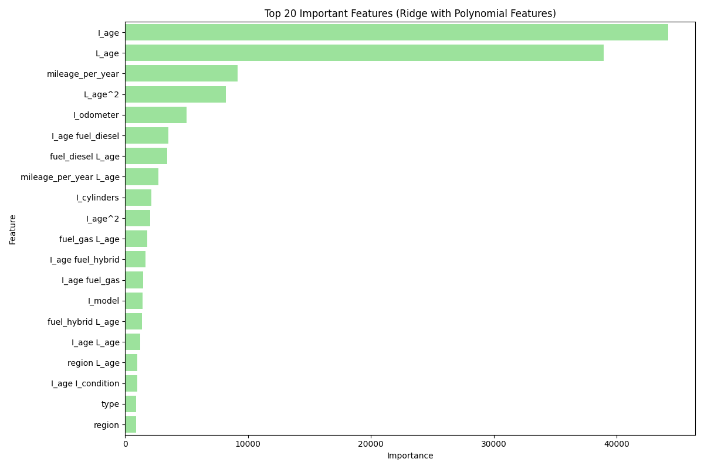
Ridge regression, with its L2 regularization, shows similar patterns to standard linear regression but with more balanced feature importance scores.

#### Lasso Regressor: Top 20 Features

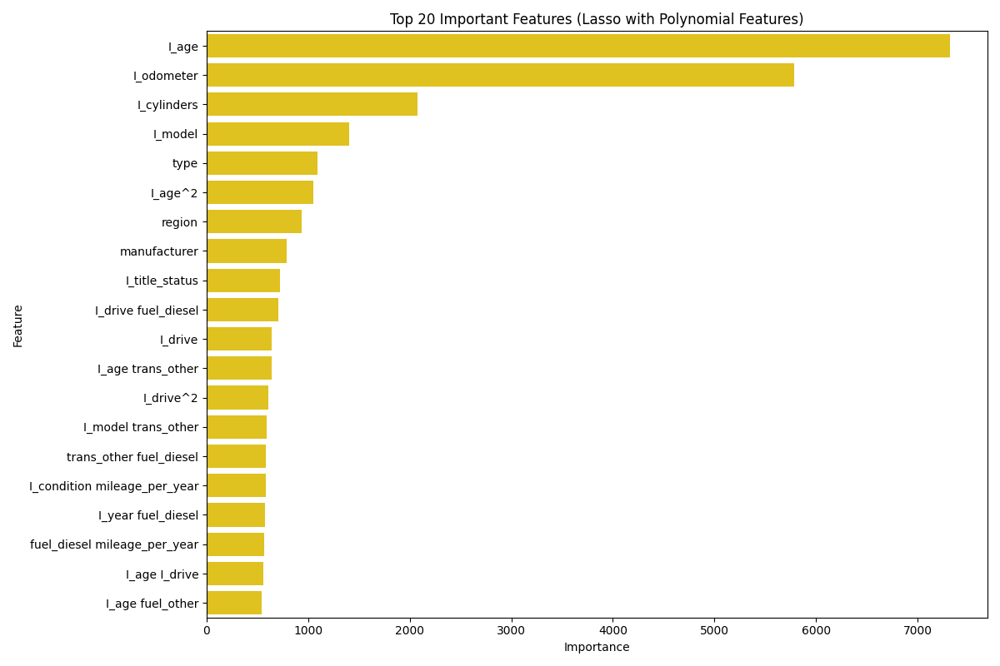
Lasso's L1 regularization tends to produce sparser feature sets, zeroing out less important features while highlighting the most critical pricing factors.

## Model Evaluation
Evaluate the model with:
- MSE (Mean Squared Error)
- R-squared

## Objective
The goal is to improve pricing precision, gain insights into factors influencing car prices, and provide data-driven recommendations for better decision-making in the used car market.

---

## Model Performance Summary
We compared multiple regression models using **Mean Squared Error (MSE)** and **R² Test Scores** to evaluate performance.

### Best Model
- **`XGBoost_Polynomial_features_best`** delivered the top results:
  - **MSE**: ~31.1 million (lowest)
  - **R² Test**: 0.79 (highest)

---
